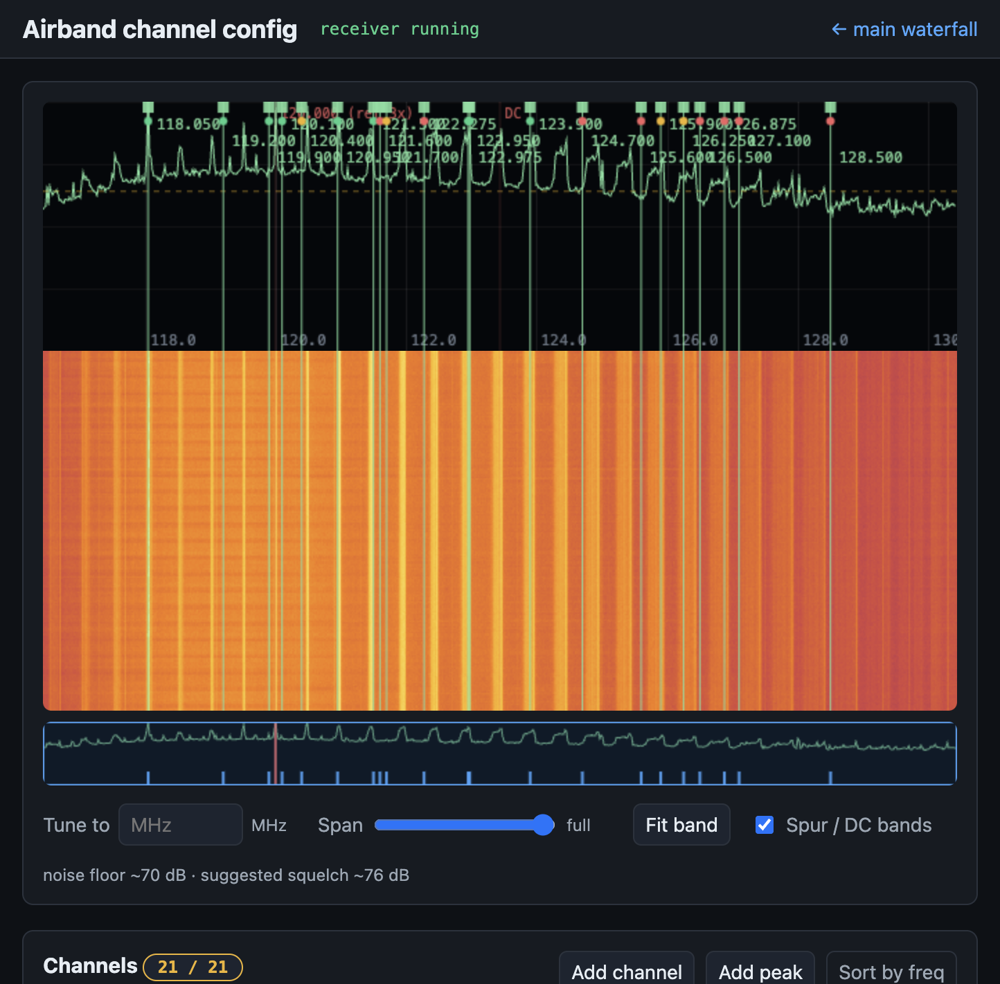
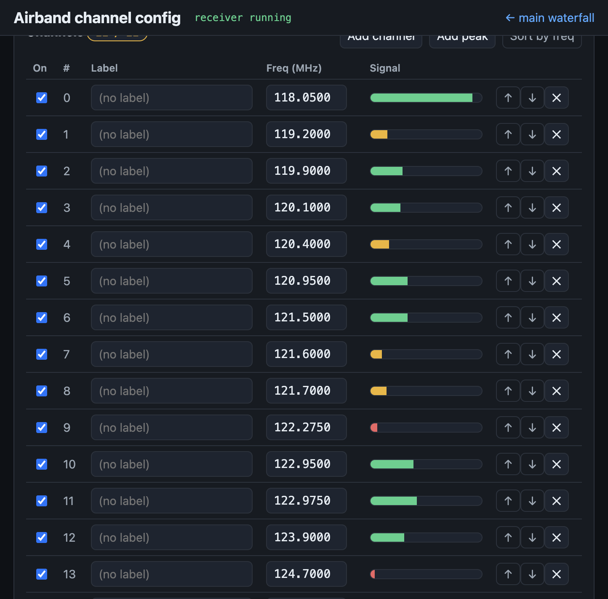
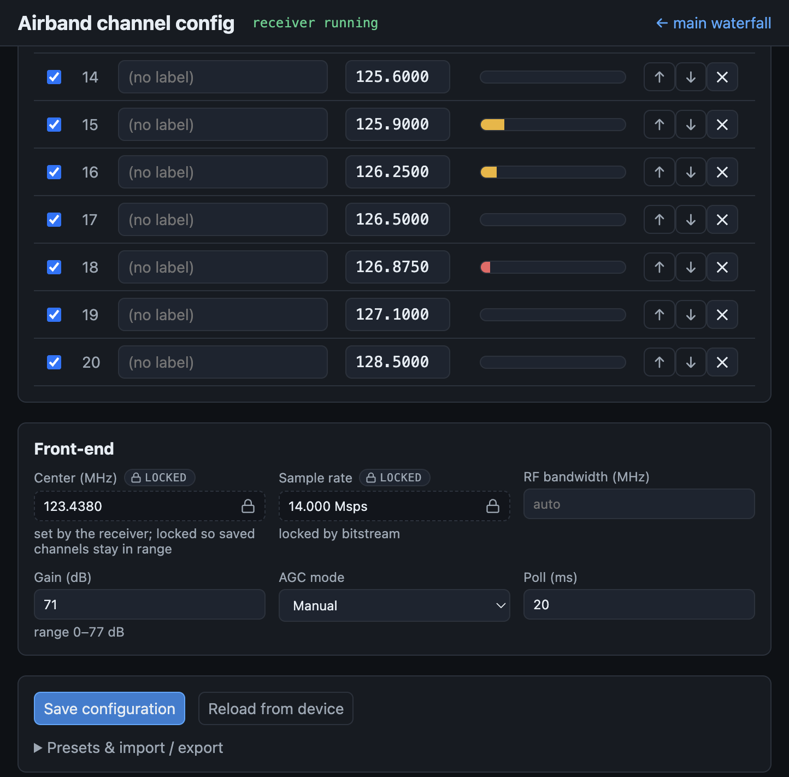

# Pluto Airband — multichannel VHF airband receiver on the ADALM-Pluto

Turn an [Analog Devices ADALM-Pluto](https://www.analog.com/en/resources/evaluation-hardware-and-software/evaluation-boards-kits/adalm-pluto.html)
into a **21-channel VHF airband (AM aircraft voice) receiver**. A single wideband
capture is split into many narrow channels entirely inside the Pluto's FPGA; each
channel is AM-demodulated to audio on-chip and streamed off the device over the
network — suitable for feeding multiple [LiveATC](https://www.liveatc.net/) audio
streams from one SDR.

> **Status:** live on hardware — all 21 channels stream gap-free and the receiver
> auto-starts on boot. See [Status & known limitations](#status--known-limitations).

## Documentation

This README is the hub. Each topic has a single home:

| If you want to… | Go to |
|---|---|
| Flash a prebuilt image and listen (fastest path) | [Quick start](#quick-start) (below) |
| Consume the audio stream from your own program | [Audio output interface](#audio-output-interface-write-your-own-client) (below) |
| Understand the design, constraints, and rationale | **[`SPEC.md`](SPEC.md)** — authoritative design spec |
| Build firmware, flash, set up the dev/build env, troubleshoot | **[`BUILD.md`](BUILD.md)** |
| Know what each FPGA/DSP block does | **[`hdl/README.md`](hdl/README.md)** |
| Diagnose audio artifacts / understand the channel "buzz" | **[`firmware/diagnostics/README.md`](firmware/diagnostics/README.md)** |
| Know the firmware image contents + DDR addressing invariants | **[`firmware/README.md`](firmware/README.md)** |
| See the engineering history and decisions | **[`PROGRESS.md`](PROGRESS.md)** |

## How it works

```
            ADALM-Pluto (Zynq-7010: FPGA + ARM)                         Host / Raspberry Pi
 ┌──────────────────────────────────────────────────────┐        ┌────────────────────────────┐
 │  AD9361 RF  ──IQ──▶  FPGA (PL)                         │        │  airband-reader (Rust)     │
 │  LO 123.438 MHz      ┌───────────────────────────────┐│  TCP   │  • demux by channel        │
 │  Fs  14 MHz          │ ReceiverTop:                   ││ :30000 │  • drop detection (seq)    │
 │                      │  channelizer (21 ch, TDM DDC)  ││──────▶ │  • 24→16-bit scale         │
 │                      │  → AM demod (|I+jQ|, DC block) ││ framed │  • WAV / raw / live stats  │
 │                      │  → audio decimate → framer     ││ 64-bit └────────────────────────────┘
 │                      │  → cyclic DMA → DDR ring       ││ records
 │                      └───────────────────────────────┘│         each record (LE u64):
 │  maia-httpd (ARM): configures AD9361 + NCOs, starts   │           [31:0]  audio sample (s24)
 │  the DMA, drains the DDR ring, serves it over TCP     │           [39:32] channel index 0..20
 └──────────────────────────────────────────────────────┘           [63:40] per-channel seq
```

- One AD9361 capture (LO **123.438 MHz**, Fs **14 MHz**) covers the 118.05–128.5 MHz
  band. The FPGA channelizer tunes a numerically-controlled oscillator per channel,
  filters/decimates to a narrow channel, and AM-demodulates to **15 625 sps** audio
  (`Fs / 128 / 7`).
- Audio for all channels is packed into 8-byte records written to a DDR ring by a
  cyclic DMA, drained by `maia-httpd`, and served as a raw TCP byte stream.
- The host reader demuxes the records back into per-channel audio and detects any
  dropped samples via the per-channel sequence counter.

This is built **on top of** [Maia SDR](https://maia-sdr.org/); the airband DSP,
DMA, and control live in our fork (`github.com/juchong/maia-sdr`, `pluto-airband`
branch). The Maia base (spectrometer/recorder/DDC) is preserved.

## Status & known limitations

- **Live on hardware:** 21 channels, gap-free TCP stream, auto-start on boot.
- **Channel "buzz" is an RF hardware spur — not fixable in firmware.** A spur comb
  phase-locked to the Pluto's 40 MHz reference (3rd harmonic at **120.000 MHz**)
  falls inside some channels' passbands. It is independent of the HDL/DSP, the
  demod, and the gain. Remedies are hardware (clean power, shielding, external
  reference, channel triage). Full root-cause analysis and a diagnostic toolkit:
  [`firmware/diagnostics/README.md`](firmware/diagnostics/README.md).
- **Single shared front-end:** one RX gain serves all 21 channels (no per-channel
  AGC). Default is fixed manual **48 dB** — the highest gain that doesn't overload
  the wideband ADC. (The earlier 71 dB clipped ~13% of samples, which *was* the
  "poor noise floor": broadband clipping intermod, not real noise. See
  [Channel plan](#channel-plan).)
- **Transmitter quieted on boot.** This is a pure receiver, but the Pluto powers up
  in FDD with the TX LO running (2.45 GHz, ~10 dB attenuation) — radiated EMI to
  nearby radios. The firmware now powers down the TX LO and floors TX attenuation at
  boot (`firmware/patch_tx_quiet.py` → `S60maia-httpd`); RX is unaffected (the
  in-band noise floor is identical with TX on/off — measured). See `SPEC.md` §5.1.
- **LiveATC feeder integration** is still pending — see `PROGRESS.md` → Next steps.

## Quick start

### 1. Flash a Pluto

Prebuilt images come from the build server. Put the Pluto in DFU mode (power on
while holding the button until the LED blinks slowly), then flash **both**
partitions (after any FPGA change you must reflash `boot.dfu` too — the bitstream
lives there and a mismatch hangs the receiver):

```bash
cd firmware/build
dfu-util -a boot.dfu     -D boot.dfu     # FPGA bitstream + FSBL + bootloader (mtd0)
dfu-util -a firmware.dfu -D pluto.dfu    # kernel + devicetree + rootfs       (mtd3)
dfu-util -a firmware.dfu -e              # detach + reboot (plain `-e` errors with >1 alt)
```

The receiver starts automatically on boot; the Pluto is reachable at `192.168.2.1`
over USB. Full build + flash + first-boot details (incl. the u-boot env that a
`boot.dfu` flash wipes) are in **[`BUILD.md`](BUILD.md)** and
[`firmware/README.md`](firmware/README.md).

> **Pluto+ variant.** On a [Pluto+](https://github.com/plutoplus/plutoplus)
> (same XC7Z010 die, `clg400` package, Gigabit Ethernet + microSD + 0.5 ppm
> VCTCXO) build with `TARGET=plutoplus` and flash `plutoplus.dfu` in place of
> `pluto.dfu`. Set the USB-PHY-reset jumper to **MIO46**, and the audio stream is
> reachable on the Ethernet `eth0` (DHCP) IP as well as USB. See
> [`BUILD.md`](BUILD.md) → "Pluto+ variant".

### 2. Listen

The host tools are a Cargo workspace (`host/`): two binaries (`airband-reader`,
`airband-listen`) over a shared DSP library (`airband-dsp`). Build everything at
once:

```bash
cargo build --release --manifest-path host/Cargo.toml
BIN=host/target/release/airband-reader

# live link health + stats: sample rate, drops, level/floor (dBFS), transmissions
$BIN 192.168.2.1:30000

# record one WAV per *transmission* (squelch-gated, timestamped, no dead air)
$BIN 192.168.2.1:30000 --mode wav --out-dir caps

# one continuous WAV per channel instead (no squelch)
$BIN 192.168.2.1:30000 --mode wav --no-split --squelch off

# raw s16le per channel (chNN.s16) to pipe into an encoder/feeder
$BIN 192.168.2.1:30000 --mode raw --no-agc --shift 6
```

**Shared DSP chain** (in `airband-dsp`, ported from RTLSDR-Airband and adapted to
the FPGA's already-demodulated, DC-blocked audio): per-channel **squelch**
(noise-floor tracking, mutes inter-transmission static), a 300–3400 Hz voice
**band-pass**, an optional **notch**, an STFT **noise reduction** stage that
attenuates the broadband hiss under the voice, and an **AGC** that normalizes
loudness and soft-clips peaks. Defaults: squelch `auto` (`--squelch-snr 9` dB),
band-pass on, denoise on, AGC on.

Because the FPGA DC-blocks the audio before the host sees it, the default squelch
works on voice energy (VOX) and uses a **hang time** (`--squelch-hang-ms`, default
1000 ms) to ride over the pauses in continuous speech (AWOS/ATIS).
RTLSDR-Airband's carrier-loss fast-close is therefore disabled here — with no
carrier it would just re-introduce chatter. Lower the hang for snappier closes on
push-to-talk traffic; raise it if a feed still chatters between words.

A bitstream built from the current `hdl/` also ships a per-channel **carrier
level** in each audio frame; with it, `--squelch carrier` gates on carrier power
instead of voice energy. All channels of one receiver see the same wideband
noise, so the host takes a high percentile (75th) of the live per-channel carrier
levels as a shared **noise reference** and opens any channel whose carrier sits
`--squelch-snr` dB above it. Because that threshold comes from the *other*
channels' noise (not a channel's own level), it holds a continuous carrier
(AWOS/ATIS) open with no hang and no chatter, while empty channels stay shut. The
new bitstream and host tools must be deployed together.

- `--squelch off|auto|manual|carrier` (`--squelch-snr`, `--squelch-level` dBFS,
  `--squelch-hang-ms`) — gating, threshold, and hang time.
- `--no-denoise`, `--denoise-floor-db <dB>` — spectral noise reduction (more
  negative floor = deeper, more aggressive cut).
- `--no-filter`, `--notch <Hz>` / `--notch-q` — band-pass / notch.
- `--no-agc` falls back to fixed-gain output, where `--shift` scales the 24-bit
  sample to 16-bit (**positive = attenuate, negative = makeup gain**; airband AM
  is quiet so a negative value is usual).
- Recording defaults to **split-on-transmission** (one timestamped file per keyed
  transmission); `--no-split` writes one continuous file, `--min-transmission-ms`
  discards blips.

**Live outputs** (any mode, independent of recording):

```bash
# Icecast MP3 feed for LiveATC.net (16 kbps mono 22050 Hz by default)
$BIN 192.168.2.1:30000 --icecast-channel 0 \
  --icecast-host feed.example.net --icecast-port 8000 \
  --icecast-mount /KXXX.mp3 --icecast-password secret

# UDP s16le PCM of one channel to another host
$BIN 192.168.2.1:30000 --udp-channel 0 --udp-dest 10.0.0.5:7355

# Prometheus metrics (per-channel samples/drops/transmissions/level/floor/open)
$BIN 192.168.2.1:30000 --metrics-port 9100   # scrape http://host:9100/metrics
```

### Audition channels live (testing)

To listen to a channel on your speakers and flip between frequencies in real time:

```bash
cargo build --release --manifest-path host/Cargo.toml
host/target/release/airband-listen 192.168.2.1:30000
```

`airband-listen` runs the same `airband-dsp` chain on the played channel (squelch
+ band-pass + AGC by default), and runs the squelch on *every* channel so the
meter shows which frequencies are active. Interactive keys: `↑/↓` (or `j`/`k`,
`[`/`]`) step channels, type a number then `Enter` to jump, `+`/`-` adjust volume,
`m` mutes, `s` toggles squelch, `a` toggles AGC, `f` toggles the band-pass, `n`
toggles a configured notch, `d` toggles **noise reduction**, `F` toggles
**follow** (scanner) mode, `q` quits.
`--monitor single|follow|mix` selects single-channel, scanner, or sum-of-open-
channels playback. The display shows a per-channel dBFS meter, a squelch-open dot,
the selected channel's squelch state, and cumulative dropped samples, so it
doubles as a quick link-health check.

### Audio output interface (write your own client)

`airband-reader`/`airband-listen` are thin clients over a single **raw TCP byte
stream**; there is no IIO device and no per-channel socket. To get audio out from
any language, implement this contract (the authoritative spec is
[`SPEC.md`](SPEC.md) §6):

- **Connect** to TCP `192.168.2.1:30000`. The server only writes; it pushes a
  continuous stream of fixed **8-byte little-endian records**, 8-byte aligned from
  the first byte (it sends whole 64 KiB buffers), so just read 8 bytes at a time.
- **Each record is one audio sample for one channel:**

```
bits [31:0]  audio sample    — signed, 24-bit content sign-extended to 32 bits
bits [39:32] channel index   — 0..20
bits [63:40] sequence number — per-channel, +1 per sample, wraps at 2**24
```

- **Demux:** switch on the channel byte and append the sample to that channel's
  stream. Each channel is mono PCM at **15625 sps** (`Fs/128/7`). Records from
  different channels are interleaved; within one channel they are in order.
- **Drop detection:** a per-channel jump in the sequence number (delta > 1) means
  `delta-1` samples were dropped (FPGA FIFO overflow or a slow client). The server
  buffers ~256 chunks per client and *lags* a client that can't keep up — that
  surfaces as a sequence jump, never a stall, so always check the counter.
- **Level:** the 24-bit sample is near unity-gain and airband AM is quiet (often
  tens of LSB), so apply makeup gain before narrowing to 16-bit (the tools default
  to a left-shift of 6 ≈ +36 dB; see `--shift`).

Minimal consumer (decode + demux, no resampling):

```python
import socket, struct
s = socket.create_connection(("192.168.2.1", 30000))
buf = b""
while True:
    buf += s.recv(65536)
    while len(buf) >= 8:
        word = struct.unpack_from("<Q", buf)[0]
        buf = buf[8:]
        sample = word & 0xFFFFFFFF
        if sample & 0x80000000:          # sign-extend the 32-bit field
            sample -= 1 << 32
        chan = (word >> 32) & 0xFF       # 0..20
        seq  = (word >> 40) & 0xFFFFFF   # per-channel sequence
        # `sample` is one 15625 sps mono sample for channel `chan`
```

### Web UI (Maia spectrometer) — front-end is read-only

The Pluto still serves the Maia SDR web UI at `http://192.168.2.1:8000`, and its
waterfall is handy for seeing live activity across the **118–128 MHz** airband
window. Because the airband receiver owns the single AD9361 front-end (its
channelizer is built for **123.438 MHz / 14 Msps**), those controls — RX freq,
sampling freq, RF bandwidth, gain, AGC — are **locked read-only** while the
receiver is running. This is deliberate: the web UI used to silently retune the
radio to its 2.4 GHz / 61.44 Msps defaults on page load, which moved the
front-end off-band and made every channel demodulate noise. The lock is enforced
server-side (`/api/ad9361` is a no-op under `--airband`), so the radio stays on
the airband band no matter what the browser does.

## Channel plan

The receiver reads `/root/airband.json` on the Pluto at startup; if absent it uses
the same built-in defaults. A template is at `firmware/airband.json`:

```jsonc
{
  "center_hz":   123438000,   // AD9361 RX LO (capture center) — keep within the built window
  "samp_rate":   14000000,    // MUST stay 14 MHz (the rate the channelizer was built for)
  "rf_bandwidth":14000000,
  "gain_db":     48.0,        // used when agc = "manual"; highest gain w/o ADC clipping
  "agc":         "manual",    // "manual" | "slow_attack" | "fast_attack" | "hybrid"
  "poll_ms":     20,
  "channels_hz": [ 118050000, 119200000, /* … up to 21 … */ 128500000 ]
}
```

Rules:
- **`samp_rate` must remain `14000000`.** The channelizer's filters/decimation are
  baked into the FPGA bitstream for this rate; changing it requires an HDL rebuild.
- Up to **21** entries in `channels_hz`, each within `center_hz ± samp_rate/2`
  (i.e. 116.438–130.438 MHz). Out-of-window channels are rejected at startup.
- Changing `center_hz` re-tunes the whole window; keep all desired channels inside it.
- **Gain:** one shared RX gain serves all 21 channels; fixed `agc: "manual"` (the
  AD9361 AGC modes settle on *wideband* power and starve weak channels). The default
  is **`gain_db: 48.0`** — the highest gain that does *not* overload the wideband
  ADC. The previous 71 dB (chosen for weak-signal sensitivity) drove the ADC into
  **hard clipping ~13% of samples**; that broadband intermod is what made the noise
  floor look terrible (effective floor ~−6 dBFS) and scattered spurs across the band.
  A measured sweep ([`firmware/diagnostics/floor_sweep.py`](firmware/diagnostics/floor_sweep.py))
  shows clipping gone by ~48 dB and the floor ~19 dB lower with no SNR loss. Raise
  toward 55–71 dB only for a quieter site / better antenna (watch the clip %); lower
  if a strong local signal still overloads. Gain does **not** remove the
  fixed-frequency channel "buzz" (the 120 MHz reference-harmonic spur; see
  [`firmware/diagnostics/README.md`](firmware/diagnostics/README.md)).

Apply a new plan:

```bash
scp firmware/airband.json root@192.168.2.1:/root/airband.json   # password: analog
ssh root@192.168.2.1 /etc/init.d/S60maia-httpd restart
```

### Web config page (recommended)

Instead of editing JSON by hand, open the browser config page served by the
Pluto:

```
http://192.168.2.1:8000/airband.html     # also linked from the main UI → settings → "Other"
```

It shows a **live spectrum + waterfall** of the captured band (fed by the same
`/waterfall` WebSocket as the main UI) with the channel plan overlaid, so you can
*see* whether a channel carries traffic before committing to it. The waterfall
uses the same dB color scaling as the main UI, so a busy band looks identical
here:



- **Add / remove / reorder / relabel** channels; drag a marker (or edit the MHz
  field) to move a channel; "Add peak" snaps a new channel onto the strongest
  visible signal. A slot counter enforces the **21**-channel limit.
- **Zoom & pan:** type a frequency to auto-zoom to it, scroll-wheel to zoom
  (tuned to stay gentle on trackpads/touchscreens), drag to pan, or use the
  **full-band minimap** to jump around. Known RF spur and DC bands are shaded so
  you can avoid placing channels on them.
- **Per-channel signal meters** (peak vs. noise floor) refresh on every
  waterfall frame, so the bars track activity in near-real time; a suggested
  squelch level is derived from the noise floor.



- **Front-end controls:** RF bandwidth, gain (**0–77 dB**, bounded), AGC mode,
  and poll interval are editable. **Center frequency and sample rate are locked**
  (marked with a lock badge): the sample rate is fixed by the bitstream, and the
  center is held so saved channels stay inside the capture window
  `[center − Fs/2, center + Fs/2)`.
- **Presets + import/export** of the JSON plan.



Saving **persists `/root/airband.json`** and shows a banner; click **Restart
receiver** (or reboot) to apply — the channelizer NCOs are programmed once at
startup, so a restart is required. The page drives the
[`/api/airband` REST API](SPEC.md#65-web-config-api-and-page); see `SPEC.md` for
the request/response schema.

## Repository layout

| Path | What |
|---|---|
| `README.md` | this hub: overview, status, quick start, channel plan, doc map |
| `SPEC.md` | the authoritative project spec (design, constraints, rationale) |
| `BUILD.md` | dev/build env, build server, firmware build + flash, troubleshooting |
| `PROGRESS.md` | running engineering log + decisions |
| `hdl/` | Amaranth HDL DSP blocks (channelizer, AM demod, framer) + sims; see `hdl/README.md` |
| `firmware/` | build scripts, devicetree patch, channel-plan template, image notes (`firmware/README.md`) |
| `firmware/diagnostics/` | RF diagnostic toolkit + the buzz root-cause analysis (`firmware/diagnostics/README.md`) |
| `host/` | Rust host workspace (shared DSP + two client binaries) |
| `host/airband-dsp/` | shared DSP library: voice band-pass, notch, squelch, noise reduction, AM AGC, dBFS |
| `host/airband-reader/` | host reader: demux, drop detection, DSP, split recording, Icecast/UDP/metrics |
| `host/airband-listen/` | interactive listener: live DSP playback, scanner/mix modes, per-channel meters |
| `maia-sdr/` | our Maia SDR fork (gitignored here; the airband HDL + `maia-httpd` integration) |
| `plutosdr-fw/` | Pluto firmware assembler (gitignored; pinned upstream) |

## Building from source

Firmware/bitstream are built on an x86-64 Linux server with Vivado 2023.2 (the Maia
Docker images are amd64-only); HDL authoring and simulation run natively on macOS.
The full recipe — Mac dev env, build server, Vivado volume, `libiio`, firmware
build + flash — is in **[`BUILD.md`](BUILD.md)** (with image specifics in
[`firmware/README.md`](firmware/README.md)).

## Credits

Built on [Maia SDR](https://maia-sdr.org/) by Daniel Estévez and the Maia SDR
project. The Pluto is an Analog Devices ADALM-Pluto (Zynq-7010 + AD9363, unlocked
to AD9364).
