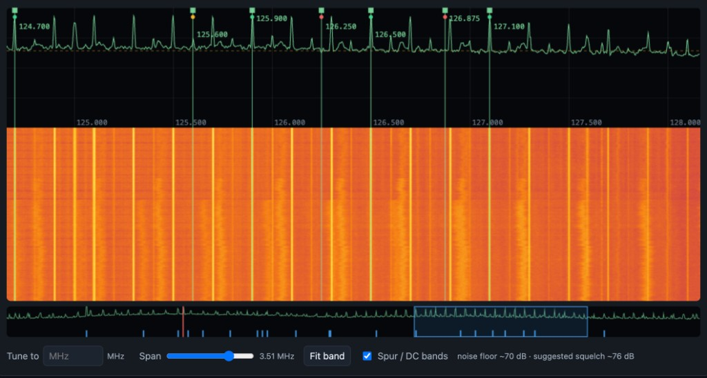
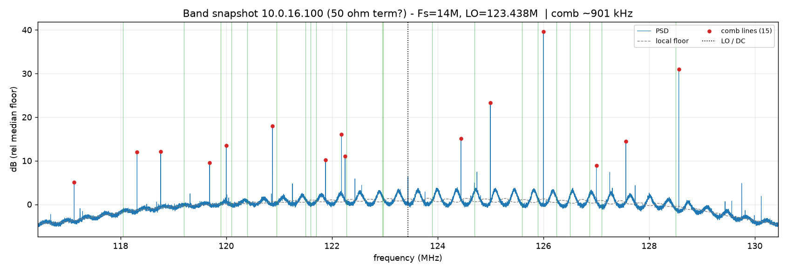
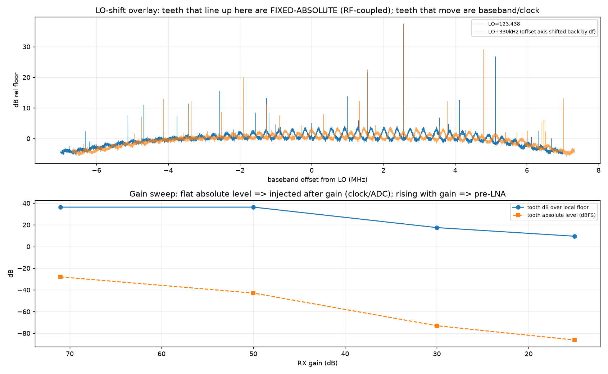
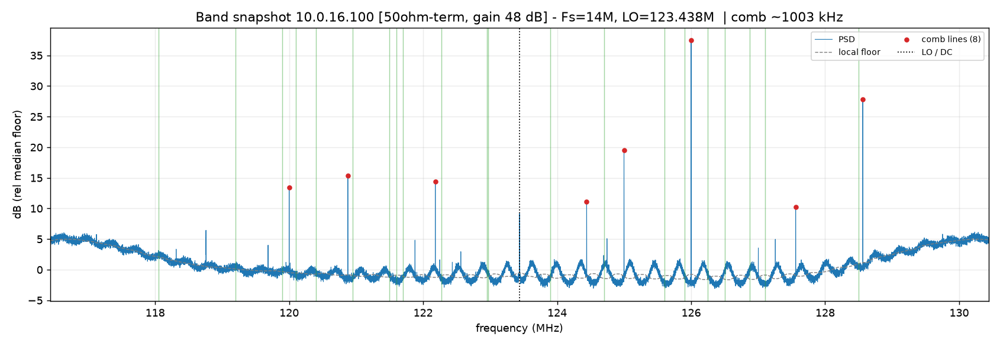
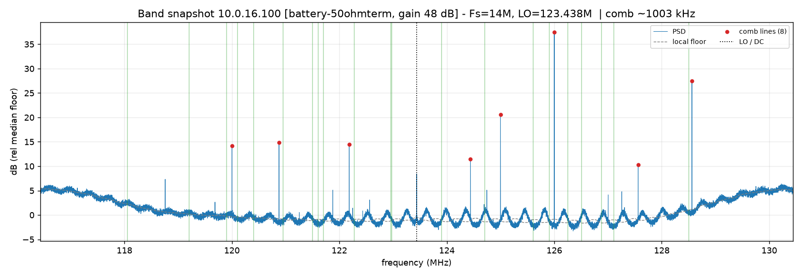
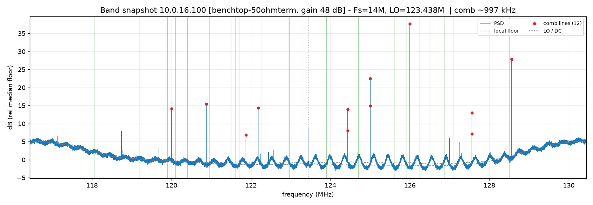
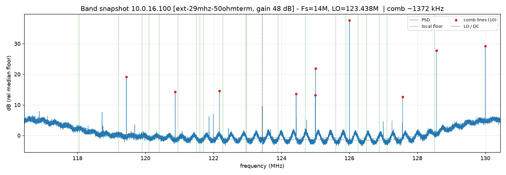
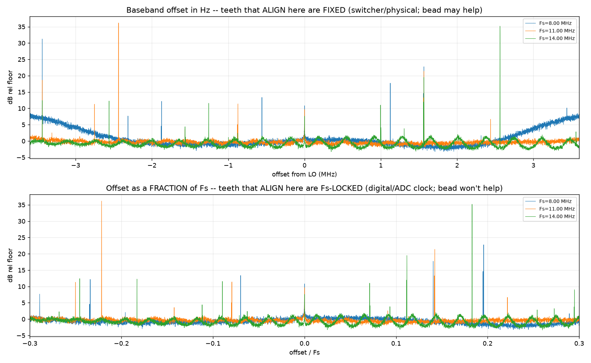
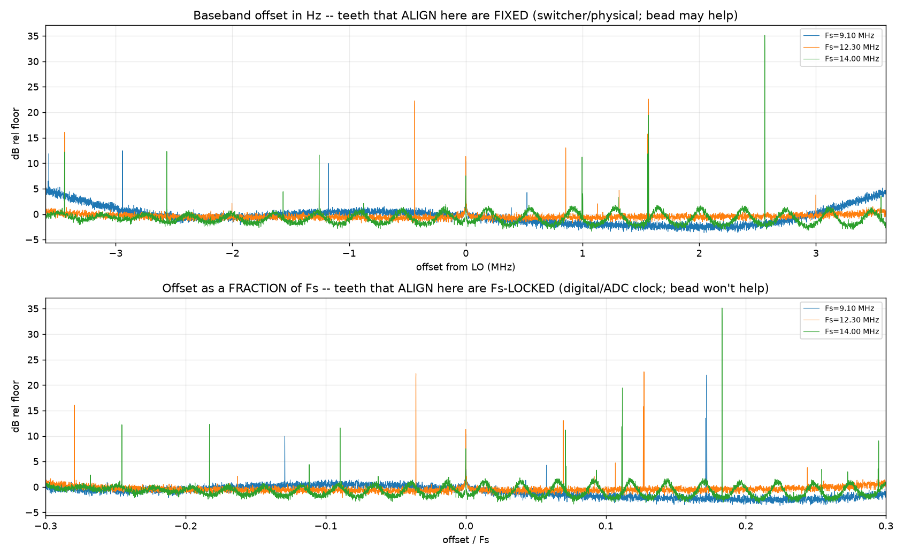
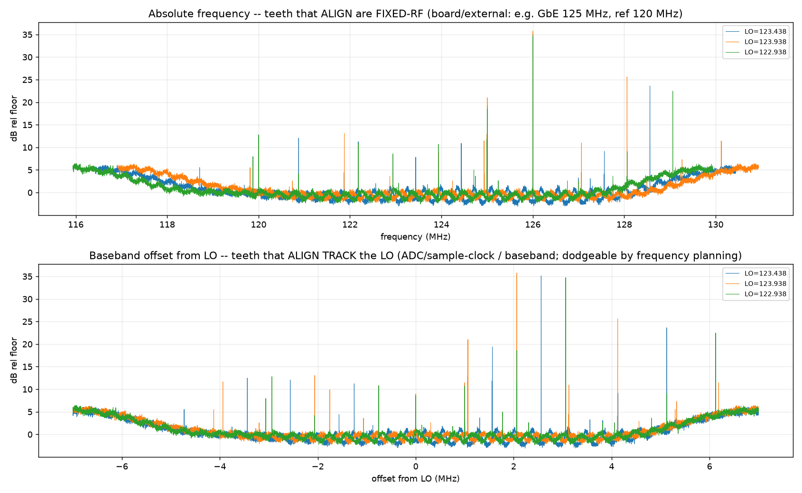

# Spur / "buzz" investigation — Pluto+ airband receiver

A bench investigation (2026-06-24, on a **Pluto+**) of the persistent wideband spur
comb and audible "buzz". It supersedes the earlier "120 MHz reference-harmonic /
on-board switching-regulator" conclusions with measured root causes. Authoritative
short form lives in [`SPEC.md` §7](SPEC.md) and the remedy table in
[`firmware/diagnostics/README.md`](firmware/diagnostics/README.md); this document is
the long-form walkthrough with the plots.

All captures were taken with the **RX input terminated into 50 Ω** (antenna
disconnected) unless noted, via the Maia recorder (raw wideband IQ), with the new
self-healing diagnostic tools. Figures are in `firmware/diagnostics/out/`.

---

## TL;DR

| tooth | source | how we proved it |
|---|---|---|
| **126.000 MHz (~36 dB, dominant)** | **9th harmonic of the 14 MHz ADC sample clock** (9×14) | fixed *absolute* under LO shift; relocates to other n·Fs under Fs shift |
| 125.004 MHz (~20 dB) | **Gigabit-Ethernet 125 MHz PHY clock** (Pluto+ only) | fixed absolute across LO **and** Fs; 125/14 non-integer |
| 120.000 MHz (~13 dB) | **40 MHz reference, 3rd harmonic** | fixed absolute; removed when the internal VCTCXO is disabled |
| 122.182 MHz (~12 dB) | unidentified fixed board source | fixed absolute |
| ~LO+1.0 MHz (124.434, ~12 dB) | ADC / baseband DC-region spur | tracks the LO (fixed baseband offset) |

**Headline corrections to earlier conclusions**

- It is **not** "an external 120 MHz RF spur you can shield/notch at the antenna":
  the comb is **conducted / on-board**, present with the antenna replaced by a 50 Ω
  load.
- It is **not** "the on-board DC-DC switching regulator": the dominant tooth is an
  **AD9361 sample-clock harmonic**, and the input power supply is provably
  irrelevant.
- The single 120 MHz line *is* the 40 MHz reference's 3rd harmonic, but it is only
  one modest tooth among several distinct sources.

**What does and does not help** (see [How to fix](#how-to-fix)): lower RX gain,
frequency planning, an external clean reference (120 MHz only), and GbE→USB / PHY
decoupling (125 MHz) help. Input power (USB/battery/benchtop), enclosure shielding,
an antenna band-pass, and a switcher↔bulk-cap ferrite **do not**.

---

## 1. Symptom

A comb of evenly-spaced peaks across the whole 118–128.5 MHz airband window, with an
audible buzz on many channels — persisting despite an excellent front end, a notch on
the strong local 118.050 MHz transmitter, and a metal enclosure.



That a *uniform, full-band* comb survives a good front end, the carrier notch, and
shielding is the first clue it is not antenna-borne RF.

## 2. Method & tooling

New host-side diagnostics (all host/IP-parametrized, self-healing over ssh against
the Pluto+'s tight 96 MB RAM, and writing descriptive non-overwriting PNGs):

| tool | purpose |
|---|---|
| `firmware/diagnostics/band_snapshot.py` | wideband FFT snapshot + comb-spacing detect |
| `firmware/diagnostics/term_tests.py` | LO cross-correlation + RX-gain sweep |
| `firmware/diagnostics/clock_shift_test.py` | Fs (digital-clock) sweep + alias / digital solvers |
| `firmware/diagnostics/lo_track_test.py` | LO sweep — tooth tracks LO vs fixed absolute |

The recorder captures raw ADC IQ, i.e. **upstream of the airband channelizer**, so
everything here is about the analog/RF/clock domain, not the DSP.

## 3. The comb is internal / conducted (50 Ω termination)

With the antenna removed and a 50 Ω load on the RX input, the comb is **still there**
— 15 discrete teeth up to ~40 dB over the floor across the full 14 MHz capture. There
is no antenna, so the energy is generated *on the board* and coupled into the front
end. This is why the enclosure, the antenna-side notch, and the front end made no
difference.



## 4. It is amplified by RX gain — and 71 dB was clipping

A terminated gain sweep (and LO localization) shows the comb scales with the RX gain
chain, and that the shipped 71 dB drove the wideband ADC into clipping (~13–15 % of
samples → broadband intermod that raised the whole floor).



Dropping to **48 dB** (the clipping knee) removes the intermod and roughly halves the
number of teeth, leaving a much cleaner floor — but the primary teeth remain:



These sweeps characterized the gain trade-off; the gain itself is **adjustable** —
set `gain_db` in the SD-card `firmware/airband.json` — and the firmware's **baked-in
default (no SD card) is 0 dB**. As a starting point an external LNA wants a low
`gain_db` (~12 dB) and a bare front end more (toward the ~48 dB clipping knee); see
[How to fix](#how-to-fix).

## 5. Input power is not the source

Identical comb on **USB**, a **battery**, and a **benchtop lab PSU** — same teeth,
same amplitudes. The conducted comb is generated by the Pluto+ itself, downstream of
whatever powers it, so clean external power does not help.

| battery | benchtop PSU |
|---|---|
|  |  |

## 6. External reference removes only the 120 MHz line

Disabling the internal 40 MHz VCTCXO (EXCLK→GND) and feeding an external **29 MHz**
reference (AWG; `ad936x_ext_refclk_override=<29000000>`), the **120.000 MHz** tooth
disappears — confirming it is the 40 MHz reference's 3rd harmonic. Every other tooth,
including the loudest, is unchanged. (The AWG injected its own spurs at 119.438 and
130.000 MHz — an AWG is not a clean reference; use a low-spur OCXO.)



## 7. The digital-clock (Fs) shift — and an alias-ambiguity gotcha

The power and reference tests both held **Fs = 14 MHz**, so neither could separate the
on-board switcher from sample-clock / ADC-domain sources. Moving the sample clock does
that. Sweeping Fs **downward** (timing-safe) with the input terminated:

- **First, with a commensurate set {14, 11, 8} MHz**, the alias-solver returned
  spurious answers spaced by **616 MHz** — the LCM of the rate set — because aliasing
  repeats every LCM. Useful lesson, misleading numbers:

  

- **Re-run with a non-commensurate set {14.0, 12.3, 9.1} MHz**, the picture is clean:
  - **Digital (∝Fs) solver: nothing.** The dominant teeth are *not* spurs at a
    constant fraction of Fs (not PL-fabric-clock-proportional).
  - **Alias solver:** the only consistent fixed in-band sources are **125.004**
    (≈125 MHz GbE clock), **120.000** (40 MHz×3), and the LO/DC leak.
  - The dominant 36 dB tooth is **present only at Fs = 14 MHz** and relocates at
    other rates (10×12.3 = 123.000, 14×9.1 = 127.400) — the signature of a
    **harmonic of the sample clock**.

  

## 8. LO-track — the definitive proof

Holding Fs = 14 MHz and stepping the **LO** ±0.5 MHz, the dominant tooth stays pinned
at **126.000 MHz absolute** (its baseband offset changes +2.562 → +2.062 → +3.062):

| LO (MHz) | dominant tooth | offset |
|---|---|---|
| 123.438 | 126.000 | +2.562 |
| 123.938 | 126.000 | +2.062 |
| 122.938 | 126.000 | +3.062 |



Fixed absolute under LO shift, **and** relocating with Fs in step 7 →
**126.000 = 9 × 14.000 MHz, the 9th harmonic of the ADC sample clock.** It is
LO-independent and reference-independent (present on both the 40 and 29 MHz
references at Fs = 14 MHz), i.e. internal to the AD9361. The 125.004 and 120.000 tones
stack at fixed absolute frequency too (board GbE clock and reference harmonic); the
small ~LO+1.0 MHz tooth instead tracks the LO (an ADC/baseband DC-region spur).

## 9. Root-cause summary

See the [TL;DR table](#tldr). In one sentence: the comb is a set of **fixed,
internally-generated clock tones** — the AD9361 sample-clock 9th harmonic (dominant),
the Pluto+ Gigabit-Ethernet 125 MHz clock, and the 40 MHz reference 3rd harmonic —
plus broadband intermod that the old 71 dB gain added on top. None of it is the input
power supply, antenna-borne RF, or the DC-DC switcher.

### Are they even audible?
After AM envelope detection a spur at offset Δf from a channel carrier produces an
audio tone at Δf, and the chain only passes ~300–3400 Hz, so a spur is **audible only
within ~±3.4 kHz of a channel carrier**. The big teeth are tens–hundreds of kHz from
the nearest carrier (the channel plan already places them in guard gaps), so they are
largely **cosmetic on the waterfall**, not the in-channel buzz. The audible buzz is
whatever finer comb lands inside a channel passband — the next thing to measure
per-channel.

## How to fix

Fix by mechanism (cheapest first). Full detail in
[`firmware/diagnostics/README.md`](firmware/diagnostics/README.md).

**Config / host (no reflash)**
1. **External LNA + modest internal gain** — the AD9361's internal gain stage is the
   dominant comb/intermod/noise generator, so run a clean low-NF external LNA up front
   and keep internal gain low. The gain is **adjustable** (`gain_db` on the SD card;
   baked-in default 0 dB): the receiver is *internal-noise-limited* (the audio floor is
   the same with the antenna or a 50 Ω load and barely moves with gain → it is ADC
   quantization + comb), so `gain_db` only needs to lift voice clear of that floor —
   with the LNA ~12 dB does that without clipping; a bare front end needs more (toward
   the ~48 dB clipping knee). The biggest further win is front-end **dynamic range** —
   a SAW airband band-pass + low-NF LNA.
2. **Feed audio over USB, not GbE** — kills the 125 MHz PHY clock (Pluto+).
3. **Host per-channel notch** (`airband-dsp::Notch`) at the fixed audio beat for any
   channel with an in-passband spur.

**AD9361 (firmware-only, iio)**
4. **Load the AD9361 programmable RX FIR as a band-stop** at the fixed spur baseband
   offsets (+2.562 / +1.566 / −3.438 MHz) — notches them in-chip, before the
   channelizer, for all channels at once.
5. **Try an alternate ADC-clock / decimation split** for Fs = 14 MHz (and softer LVDS
   DATA_CLK drive) to move/weaken the 9th-harmonic sample-clock tooth.

**Bitstream / HDL (reflash)**
6. **Tighten the channelizer cleanup FIR** (~±6 → ±3.5 kHz; same tap count) to reject
   near-edge spurs.
7. **FPGA wideband notch** at the fixed offsets (if the chip FIR is insufficient).
8. **Change Fs / decimation** so 9·Fs lands in a guard gap — root fix for the
   sample-clock tooth, largest effort.

**Hardware (not DSP)**
9. External low-spur **OCXO** reference (120 MHz), clock-tree / ADC decoupling +
   local shielding (126 MHz), GbE PHY decoupling (125 MHz). A switcher↔bulk-cap
   ferrite is **not** indicated (no dominant tooth rides that rail).

**Frequency planning:** keep channels ≥ ~10 kHz from 126.000 / 125.004 / 120.000
(the shipped plan already does).

## Reproduce

```bash
cd firmware/diagnostics
export PLUTO_HOST=<device-ip>            # e.g. 10.0.16.100
PY=../../.venv/bin/python

# wideband snapshot at the current gain (auto-named by condition+gain+date)
$PY band_snapshot.py "$PLUTO_HOST" 0.3 50ohm-term

# RX-gain dependence + LO cross-correlation (fixed-abs vs baseband)
$PY term_tests.py "$PLUTO_HOST"

# digital-clock (Fs) sweep + alias/digital solvers
PLUTO_GAIN=48 $PY clock_shift_test.py "$PLUTO_HOST"                 # non-commensurate default
PLUTO_FS=14,11,8 PLUTO_GAIN=48 $PY clock_shift_test.py "$PLUTO_HOST" # (commensurate: see the LCM artifact)

# LO sweep: does a tooth track the LO or stay fixed-absolute?
PLUTO_GAIN=48 $PY lo_track_test.py "$PLUTO_HOST"
```

> The Fs/LO tools drive the AD9361 directly over libiio (the `/api/ad9361` path is a
> no-op under `--airband`) and restore state on exit. On the Pluto+'s 96 MB userspace,
> IQ recordings can OOM-kill `maia-httpd`; the tools self-heal it over ssh
> (password `analog`) and re-apply gain. Changing the reference needs
> `ad936x_ext_refclk_override` + an EXCLK jumper move — see `SPEC.md` §5.2.

## Caveats / lessons

- **Alias ambiguity:** with a commensurate Fs set the alias-solver is ambiguous
  modulo the LCM (14/11/8 → 616 MHz). Use a non-commensurate set.
- **AWG ≠ clean reference:** the AWG added its own spurs; for a real reference fix use
  a low-spur OCXO.
- **Waterfall ≠ audio:** wideband teeth in guard gaps are cosmetic; only spurs within
  ~±3.4 kHz of a carrier are audible.
- **Gain is adjustable; the firmware's baked-in default is 0 dB.** The operational
  gain is set by `gain_db` in the SD-card `firmware/airband.json`; only when no SD card
  is present does `maia-httpd` (`AirbandConfig::default`, in the maia-sdr fork) fall
  back to **0 dB**. The sweeps above characterize the trade-off: ~71 dB clips the
  wideband ADC ~15 %, ~48 dB is the clipping knee, and 0 dB leaves the wanted signal at
  the ADC quantization floor (the receiver is internal-noise-limited). As a starting
  point ~12 dB suits an external LNA and a bare front end wants more.
